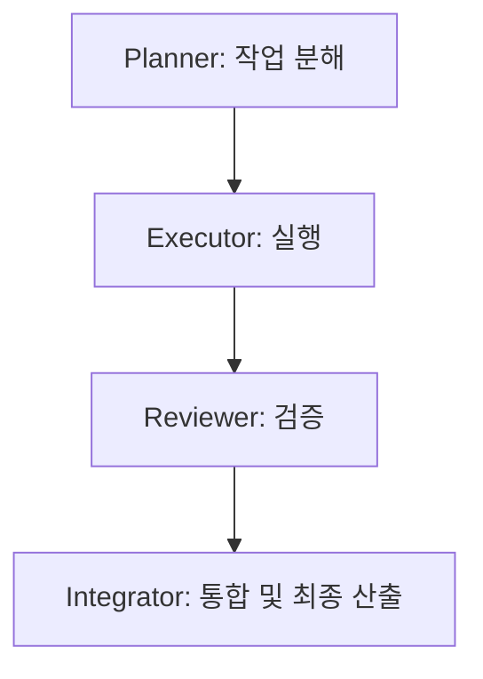
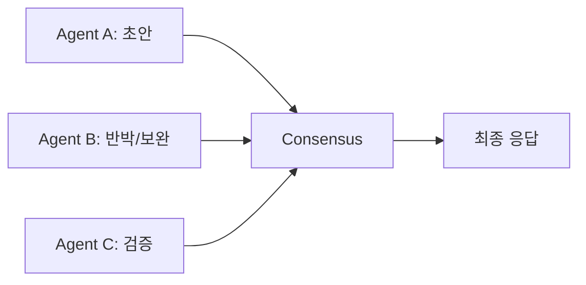

# 자동화를 위한 멀티 에이전트 설계 기초 리서치

> 목적: 자동화 프로그램 설계를 시작하기 위해, **현재 유행하는 멀티 에이전트 구축 방식**, **문제 유형별 역할 분리**, **데이터 교환 방식**, **워크플로우 및 의사결정 흐름**을 정리한 심층 리서치 문서.

---

## 1. 요약 (Executive Summary)

- **멀티 에이전트의 핵심 트렌드**는 “역할 분리 + 오케스트레이션 + 안전장치”로 요약된다.
- 대표적인 구현 패턴은 **Plan-Execute-Review**, **Debate/Deliberation**, **Tool-augmented 협업**이다.
- 실무적으로는 **작업 분해(Planner) → 실행(Executor) → 검증(QA/Reviewer) → 통합(Integrator)**의 파이프라인이 가장 많이 사용된다.

---

## 2. 현재 유행하는 멀티 에이전트 접근 방식

### 2.1 대표 프레임워크/패턴 (개념적 분류)

1. **오케스트레이터 중심 (Centralized Orchestration)**
   - 한 개의 상위 에이전트가 하위 에이전트 작업을 분배하고 조율한다.
   - 장점: 통제 용이, 일관성 유지
   - 단점: 병목 가능

2. **협상/토론 기반 (Debate/Deliberation)**
   - 여러 에이전트가 동일 문제를 병렬로 풀고 서로 반박하며 최종 결론을 도출한다.
   - 장점: 정확도 및 안정성 개선
   - 단점: 비용/시간 증가

3. **워크플로우 기반 (State Machine/Graph)**
   - 상태 전이를 명시적으로 설계해 작업 흐름을 관리한다.
   - 장점: 재현성, 디버깅 용이
   - 단점: 설계 비용 증가

4. **도구 중심 (Tool-augmented Multi-agent)**
   - 에이전트가 각자 도구를 활용해 결과를 생성하고, 통합 단계에서 합친다.
   - 예: 검색/DB/코드 실행/이미지 처리 등을 분업

---

## 3. 문제 유형별 멀티 에이전트 설계

| 문제 유형 | 권장 역할 구성 | 특징 |
|---|---|---|
| 리서치/문서 작성 | Planner, Researcher, Writer, Reviewer | 정보 수집 및 요약 흐름 강화 |
| 코드 개발 | Architect, Developer, Tester, Reviewer | 설계 → 구현 → 테스트 → 리뷰 |
| 운영 자동화 | Orchestrator, Executor, Monitor, Auditor | 안정성·로그·알람 중요 |
| 데이터 분석 | Analyst, ETL Agent, Visualizer, QA | 데이터 전처리 및 검증 단계 중요 |

---

## 4. 에이전트 간 데이터/자료 교환 방식

### 4.1 공유 메모리 vs 메시지 패싱

- **공유 메모리(Shared Workspace)**
  - 공동 문서/지식베이스에 기록
  - 장점: 전체 가시성
  - 단점: 충돌 관리 필요

- **메시지 패싱(Message Passing)**
  - 직접 메시지를 주고받음
  - 장점: 역할 분리 명확
  - 단점: 히스토리 추적 필요

### 4.2 교환 데이터 유형

- **중간 산출물**: 요약, 후보 답안, 코드 스니펫
- **메타데이터**: 신뢰도 점수, 출처, 근거
- **의사결정 로그**: 왜 특정 결론을 선택했는지

---

## 5. 워크플로우와 의사결정 흐름 예시

### 5.1 Plan → Execute → Review



### 5.2 Debate/Deliberation



### 5.3 의사결정 규칙 (스코어링 기반)

- 각 에이전트가 답안에 대한 **신뢰도(Confidence)** 점수를 부여
- 최종 결론은 **가중합 스코어**가 높은 답안을 선택

\[
Score = \sum_{i=1}^{n} w_i \cdot c_i
\]

- \(w_i\): 에이전트 가중치
- \(c_i\): 에이전트 신뢰도

---

## 6. 멀티 에이전트 설계 핵심 체크리스트

- [ ] **역할 분리**가 명확한가?
- [ ] **에이전트 간 컨텍스트 공유 전략**이 있는가?
- [ ] **검증/리뷰 단계**를 포함하는가?
- [ ] 실패 시 **fallback 전략**이 있는가?
- [ ] 로그/모니터링 체계가 있는가?

---

## 7. 실무 적용 시 고려사항

### 7.1 안정성과 비용
- 멀티 에이전트는 정확도를 올리는 대신 비용과 지연이 증가한다.
- 업무 중요도에 따라 **다중 에이전트 사용 범위**를 제한하는 것이 효과적이다.

### 7.2 신뢰성과 감사 가능성
- 의사결정 로그를 남겨야 추적 가능하다.
- 최종 산출물에는 **근거/출처/검증 결과**를 포함해야 한다.

---

## 8. 참고 가능한 오픈소스/프레임워크 (개념적 분류)

> 본 문서는 개념 정리 중심이며, 세부 구현은 향후 단계에서 실제 프레임워크 비교/실험 필요.

- **AutoGen 계열**: 에이전트 간 대화/협업 중심
- **CrewAI 계열**: 역할 기반 태스크 분배
- **LangGraph 계열**: 상태 머신 기반 워크플로우
- **Swarm 패턴**: 다수의 단순 에이전트를 유기적으로 묶는 방식

---

## 9. 다음 단계 제안

1. **문제 정의**: 자동화 대상 범위 확정
2. **워크플로우 프로토타입**: 가장 단순한 Plan-Execute-Review 구조 구현
3. **평가 체계 도입**: 성공률/비용/시간을 측정하는 KPI 설계
4. **확장**: 필요 시 Debate 구조나 추가 툴 통합

---

## 10. 부록: 간단한 의사코드 예시

```python
class Agent:
    def __init__(self, role):
        self.role = role

    def act(self, context):
        # 역할별 행동 정의
        return f"{self.role} output"

pipeline = ["Planner", "Executor", "Reviewer", "Integrator"]
context = {}

for role in pipeline:
    agent = Agent(role)
    output = agent.act(context)
    context[role] = output

print(context)
```

---

### 버전
- v0.1 (초안)
